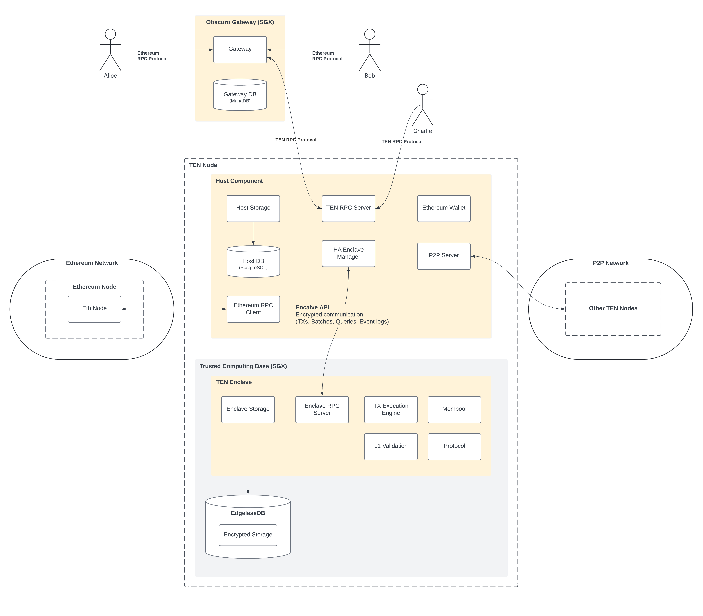

# Ten Node Architecture

This is an advanced document that describes the technical architecture of a Ten deployment.

While Ten has similarities with other Ethereum L2s, the setup is more complex, as shown in the following diagram
that depicts the main components and their responsibilities.

*Note: The Ethereum node components are developed and maintained by third-parties. E.g.: Infura*

## Trusted Computing Base (TCB)

Ten makes use of Intel SGX to protect the execution of transactions and the state from node operators.
For development, we use the EGo SDK from Edgeless, and EdgelessDB.

The Ten TCB has two components: the Ten Enclave, and the encrypted database.

### The Ten Enclave

From a high level, the Ten Enclave (TE) is a process that exposes an RPC server (currently gRPC).

The TE is a process that loads the SGX enclave built from the source code. The EGo SDK handles the low level I/O
interactions
and communication.

The TE has two interfaces points:

1. The RPC server
2. The Storage

The next section will cover the main logical components of the TE.

### 1. The RPC server

The Ten Enclave processes various types of information, including:

* Ethereum Transactions: These are transactions submitted to the management contracts and the message bus.
* User Transactions: Encrypted Ten transactions submitted by users, either through the Gateway or directly to the RPC
  server.
* Sequencer Batches and Rollups: Ten batches and rollups submitted by the sequencer.
* Data Requests: Users can query transaction receipts or any of the `eth_` requests.
* For each of these operations, there are corresponding RPC endpoints, along with additional functionalities.
*

### 2. Transaction Execution Engine

The latest iteration of Ten utilizes the EVM execution engine sourced from go-ethereum. A wrapper has been developed to
facilitate necessary pre and post-processing operations while maintaining the core execution intact.

Additionally, the key/value storage system originally employed by the go-ethereum EVM engine has been substituted.

### 3. The Storage

The TE is a stateful component that needs access to both the EVM state and the Ten chain information.

The TE initiates a mutually authenticated TLS connection to another enclave housing a SQL engine. Over this encrypted
channel,
SQL read and write statements are transmitted securely.

### Error Handling

The enclave has the capability to return two types of errors:

1. System Errors: These errors stem from unexpected malfunctions, like disk space exhaustion.
2. User Errors: These errors arise due to unprocessable user requests.

For User Errors, the TE encrypts the error message with the user's viewing key to ensure that only the corresponding
user can decipher it. System Errors are returned in plain text to facilitate straightforward handling.

### EdglessDB

EdgelessDB is an open-source database designed for confidential computing environments, offering security features and
high performance. Running entirely within Intel SGX enclaves, EdgelessDB ensures that all data, both in memory and on
disk, remains encrypted at all times. Leveraging a manifest system akin to smart contracts, EdgelessDB provides a
framework for defining database states and access controls.

- Always Encrypted: Data is encrypted both on disk and in memory.
- Manifest: A JSON-based contract system defining the initial database state and access controls.
- Remote Attestation: Proves the secure execution of EdgelessDB within an enclave, enforcing the manifest's parameters.

EdglessDB is architecturally based on MariaDB and utilises an enhanced version of RocksDB as its storage engine.

## The Host

The Host component is the external layer of our architecture, operating outside the Trusted Computing Base (TCB). It
offers extensive functionality while providing two crucial advantages:

- Minimizing TCB Complexity: By moving certain functionalities outside the TCB, the Host component reduces the size and
  complexity of the Trusted Computing Base.
- Reducing TCB Churn: By handling non-essential operations, the Host component decreases the frequency of
  re-attestations required for the TCB.

The Host and the enclave function as separate OS processes, rather than threads within a single process. This
architectural decision aligns with our initial target Trusted Execution Environment (TEE), Intel SGX, which mandates
separate process execution.

Communication between the Host and the enclave occurs via Remote Procedure Call (RPC), facilitated by the gRPC library.

gRPC was chosen for its open-source nature (Apache 2.0 license) and widespread adoption.

For simplicity, the transport layer lacks authentication (e.g., TLS or credentials). However, to mitigate potential
security risks, the enclave maintains full control over rollup rewards allocation. This design prevents unauthorized
access and misuse by parasitic aggregators seeking to economize on operational costs.

To enhance system modularity and resilience, the enclave process is supervised and managed independently of the Host
process.

## Host design

The Host component carries out a multitude of responsibilities, including:

- Serving requests for data and transaction submissions.
- Supplying data to the enclave to ensure synchronization with the L1 and L2 networks.
- Publishing secret requests/responses and rollups (for the sequencer) to the L1 network.
- Exchanging Ten data (e.g., batches and mempool transactions) with peer nodes.
- Handling failover and recovery procedures for the enclave to maintain high availability (HA) nodes.

The Host architecture is structured around a diverse set of services, each tasked with managing specific
responsibilities within the system.

The following diagram shows a high-level view of the main services involved:

## The Ten Gateway

The Ten Gateway serves as a bridge between a Ten node and external tools like MetaMask, facilitating secure
communication due to data encryption within the Ten node. Adhering to the Ethereum JSON-RPC specification the Ten
Gateway ensures seamless integration.

The onboarding process is streamlined, requiring just a few clicks on a website hosting the Ten Gateway to add the
network to their wallet, connect, and sign over an EIP-712 formatted message, including an encryption token.